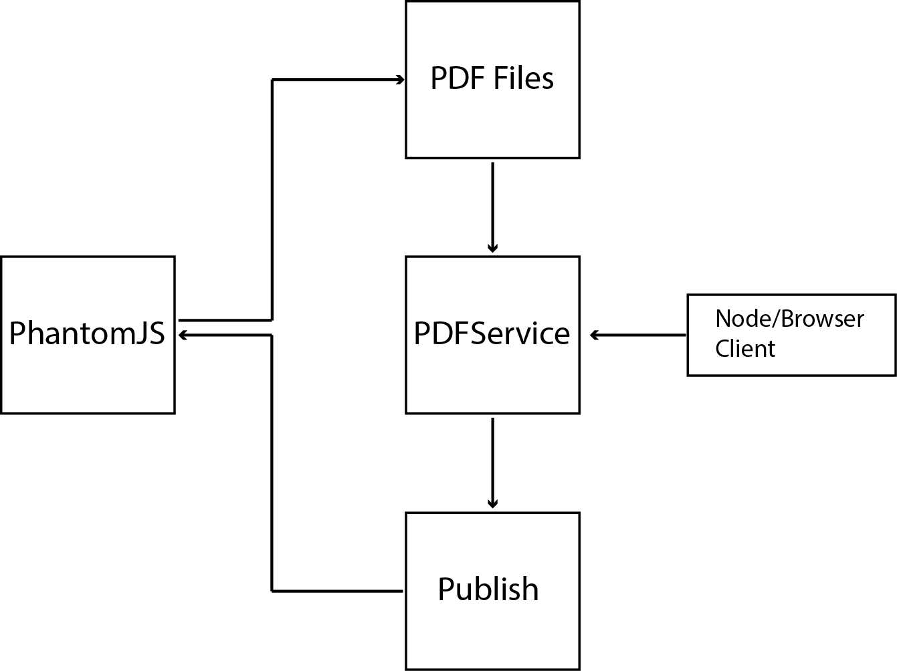

# PDF Service

The PDF service is build using nodejs and Phantomjs, provide a easy way to transform HTML to PDF. 

## Features

__&#8226; Page capture:__
You can capture a complete webpage into a PDF. 

__&#8226; HTML to PDF:__
Transform styled HTML into PDF. 

__&#8226; HTML/CSS to PDF:__
Transform HMTL styled using CSS files to PDF.

#Design

####Modules/Libraries

* __PhantomJS__ 
This is a headless Webkit engine that provides HTML/PDF rendering.

* __Cheerio__ 
Provides DOM manipulation in server side. 

* __Service__
This module provides orchestration between the clients and the Phantom engine, also providing the resource management and HTML publishing capabilities. 

#### Service Endpoints 
+ __verb:__ POST

+ __path:__ /api/pdf

+ __HTTP__ request parameters   
         url: url of the target page example www.google.es.

            
+ __verb:__ POST 

+ __path:__ /api/html

+ __HTTP__ request parameters   
        html: type string (utf-8) data with HTML to transform to PDF, if you are using (style) tags for your styling, you are done!. 
        host: (optional)  if you are reference CSS files inside your HTML, you need to fill this parameter with the relative server location. 
        For better results make sure is reachable from outside.   
    

